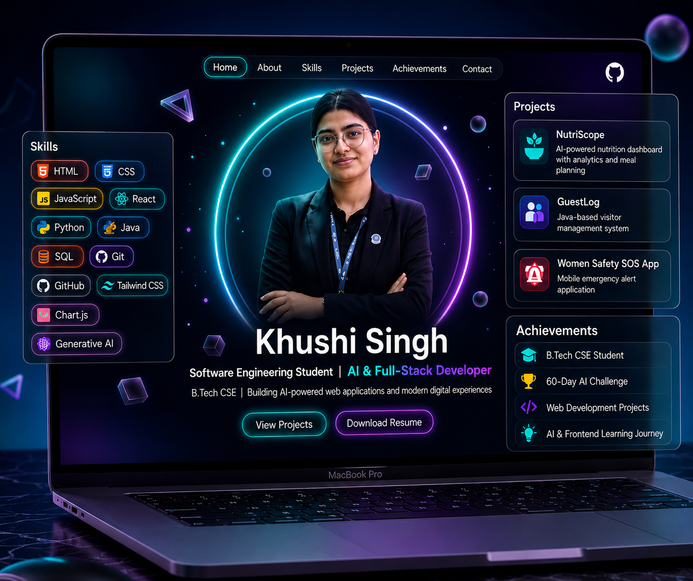

# Day 10 — CareerPilot: AI Resume & Career Dashboard

## Project Overview

CareerPilot is a modern AI-inspired career dashboard that helps students organize their resume, track skills, monitor internship readiness, and receive personalized career recommendations through a clean SaaS-style interface.

## Features

* Resume completion tracker
* Skill progress dashboard
* Internship readiness score
* AI-powered career recommendations
* Daily learning tracker
* Project portfolio section
* Certification timeline
* Application tracker
* Interview preparation checklist
* Interactive charts and analytics

## Tech Stack

* HTML5
* CSS3
* JavaScript (ES6)
* Chart.js

## Why I Built This

As a Computer Science student, I wanted a dashboard that combines **resume management, skill tracking, internship preparation, and AI-inspired career insights** into one modern portfolio-ready application.

## What I Learned

* Dashboard UI/UX design
* Data visualization with charts
* Career-oriented product design
* Responsive frontend development
* SaaS-style interface creation

## Day 10 Reflection

Today I focused on building a **career-focused AI dashboard** that can help students prepare for internships, improve their skills, and present themselves professionally.

---

**Built by Khushi Singh**

Part of my **#60DayAIChallenge**
